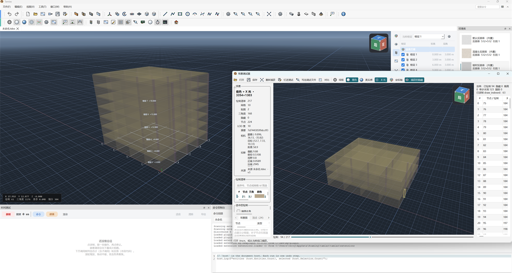

# Tamias

跨 MCAD / BIM 的几何查看 + 参数化编辑内核。



## 快速开始

```powershell
cmake --preset msvc
cmake --build --preset relwithdebinfo --parallel
& .\build\bin\RelWithDebInfo\tamias.exe
```

前置依赖与常见问题见 [BUILD.md](BUILD.md)；切换浏览器（WASM）预设见 [WEB.md](docs/WEB.md)。

## 文档

- [**入门教程**](docs/tutorial/index.md) —— 把 Tamias 当教学样例，带你入门 C++ 3D 开发（10 章 + 术语表）
- 总览 —— [路线图](docs/ROADMAP.md)、[MCAD 与 BIM](docs/DECISION-MCAD-BIM.md)、[架构](docs/ARCHITECTURE.md)
- [答疑（Q&A）](docs/FAQ.md) —— 场景规模、BRep、mipmap、UE / OSG / VSG、RHI、插件、拾取、文字、浮点、LOD
- [测试](docs/TESTING.md) —— `ctest` / GoogleTest、覆盖面与缺口
- [脚本与命令控制台](docs/SCRIPTING.md) —— 面板里敲 C#、命令回显、脚本文件与「全信任」的边界
- [通用编辑](docs/EDIT-OPERATIONS.md) —— 移动 / 复制 / 旋转 / 镜像 / 阵列：选择集 → 一条可撤销命令
- 模块文档 —— 按 [客户端](docs/APP.md) / [插件](docs/plugin/index.md) / [BIM](docs/BIM.md) / [场景图](docs/SCENE-GRAPH.md) / [造型](docs/FEATURE-TREE-EVALUATOR.md) / [渲染](docs/RENDERING.md) 分类

在线站点：https://terry-chao.github.io/tamias/

## 官网结构（给改站点的人）

站点 = **产品官网 + 文档站**，一套 MkDocs + cinder 主题构建，都在 `overrides/` 里改：

| 想改什么 | 改哪 |
|---|---|
| 首页落地页（Hero / 功能 / 工作流 / 架构 / 文档入口 / 快速开始） | `overrides/home.html` + `docs/css/home.css` |
| 顶栏、文档三栏布局、页脚、通用组件样式 | `overrides/nav.html`、`overrides/docs-layout.html`、`overrides/footer.html`、`docs/css/brand.css` |
| 404 页 | `overrides/404.html` |
| 文档侧栏的目录树 | `overrides/nav-tree.html`（结构来自 `mkdocs.yml` 的 `nav`） |
| 小黑交互（小屏菜单、首页顶栏透明、宽表格滚动、「上一页/下一页」快捷键） | `docs/js/site.js` |

两处容易踩的坑：

1. 模板里链到别的页面要用**页面 URL**（`{{ 'BIM/'|url }}`），不能写 `BIM.md` —— MkDocs 的 `url` 过滤器只做相对化，不会把 `.md` 换成页面 URL（markdown 正文里的 `.md` 链接才会被自动转换）。
2. 首页上的图标是 `assets/icons/*.svg` 的副本，放在 `docs/img/icons/`（`assets/` 不会进站点产物）；改了图标记得同步。
